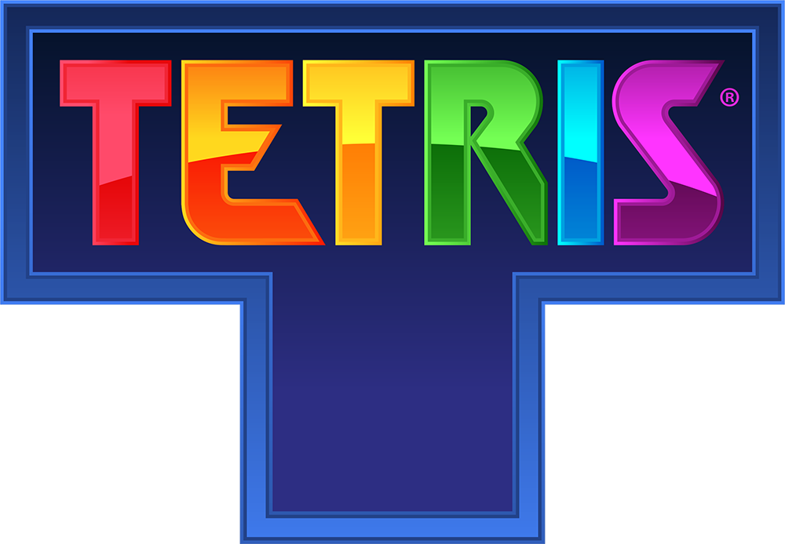

# Welcome to My Tetris

A fully featured Tetris game built with vanilla JavaScript and HTML5 Canvas. Featuring classic gameplay mechanics including hold pieces, ghost pieces, wall kicks, a 7-bag randomizer, progressive difficulty, and immersive audio — all rendered with a polished space-themed visual style.



---

## Task

What is the problem? And where is the challenge?

The challenge lies in faithfully recreating the classic Tetris experience using only web technologies — without any frameworks or game engines. Key technical difficulties include:

- **Rotation & Wall Kicks** — Implementing SRS-style (Super Rotation System) rotation with wall kick offsets so pieces don't get stuck at walls or other blocks.
- **Lock Delay** — Balancing the lock delay timer and grace moves so the game feels responsive yet fair.
- **Ghost Piece Projection** — Calculating and rendering a transparent preview of where the current piece will land.
- **7-Bag Randomizer** — Ensuring fair piece distribution using the 7-bag algorithm so players never go too long without a needed piece.
- **Progressive Difficulty** — Smoothly scaling game speed and scoring across levels while maintaining playability.
- **Canvas Rendering** — Drawing the board, UI panels, animated backgrounds, and 3D-styled tetriminos at a consistent 60 fps.

---

## Description

How have you solved the problem?

The game is structured into modular JavaScript ES6 files, each handling a single responsibility:

| Module             | Responsibility                                      |
|--------------------|-----------------------------------------------------|
| `game.js`          | Core game loop, piece spawning, lock logic, and hold |
| `board.js`         | Board creation and state management                 |
| `piece.js`         | Tetrimino definitions (shapes and colors)            |
| `collision.js`     | Movement validation against board boundaries         |
| `rotation.js`      | Clockwise/counter-clockwise rotation with wall kicks |
| `controller.js`    | Keyboard input dispatch                             |
| `randomBag.js`     | 7-bag randomizer for fair piece sequence             |
| `renderer.js`      | All Canvas 2D rendering (board, UI, effects)         |
| `scoring.js`       | Score calculation, level progression, and speed      |
| `sound.js`         | Audio manager for music and sound effects            |
| `constants.js`     | Shared game dimensions and layout constants          |

**Key design decisions:**

- **Lock delay with grace moves** — A piece enters a locking state after settling, but the player has 3 grace ticks and 500 ms to make adjustments before it locks permanently.
- **Move limit (15 moves)** — Prevents infinite stalling by capping horizontal and rotation moves per piece.
- **3D bevel rendering** — Cells are drawn with highlight/shadow edges and an inner gradient to create a polished, tactile block appearance.
- **Animated start screen** — Displays the Tetris legal notice and logo with a pulsing "PRESS ANY KEY TO START" prompt.

---

## Installation

How to install your project? npm install? make? make re?

**Prerequisites:** [Node.js](https://nodejs.org/) (v14 or higher)

No package manager or build step required — the project uses zero dependencies.

```bash
# Clone the repository
git clone https://git.us.qwasar.io/my_tetris_215848_sh8rhg/my_tetris.git

# Navigate into the project directory
cd my_tetris
```

To start the local development server:

```bash
node html_server.js
```

The server starts on **port 8080**. Open your browser and navigate to:

```
http://localhost:8080
```

Alternatively, you can open `index.html` directly in a modern browser (Chrome, Firefox, Edge) — no server needed.

---

## Usage

How does it work?

```
./html_server.js
```

### Controls

| Key              | Action                           |
|------------------|----------------------------------|
| `←` / `→`       | Move piece left / right          |
| `↓`              | Soft drop                        |
| `↑`              | Rotate clockwise                 |
| `Z`              | Rotate counter-clockwise         |
| `Space`          | Hard drop (instant placement)    |
| `C` / `Shift`    | Hold current piece               |
| `R`              | Restart the game                 |
| *Any key*        | Start the game (start screen)    |

### Gameplay Features

- **Hold Piece** — Store one piece for later use (press `C` or `Shift`). Can only hold once per piece.
- **Ghost Piece** — A dashed outline shows where the piece will land.
- **Next Queue** — Preview the next piece in the right-side panel.
- **Scoring** — Clear 1 line for 100 pts, 2 for 300, 3 for 500, and a Tetris (4 lines) for 800 — all multiplied by the current level.
- **Level Progression** — Level up every 5 lines cleared. Speed increases from 1000 ms down to a minimum of 100 ms per drop.

### Project Structure

```
my_tetris/
├── index.html              # Entry point
├── style.css               # Global styles and animations
├── html_server.js          # Local Node.js development server
├── assets/
│   ├── images/
│   │   └── Tetris_logo.png
│   ├── music/
│   │   └── Song1KorobeinikiStartScreen.mp3
│   └── sounds/
│       ├── border.mp3
│       ├── GameOver.mp3
│       ├── levelUp.mp3
│       ├── score.mp3
│       └── space.mp3
└── js/
    ├── board.js
    ├── collision.js
    ├── constants.js
    ├── controller.js
    ├── game.js
    ├── piece.js
    ├── randomBag.js
    ├── renderer.js
    ├── rotation.js
    ├── scoring.js
    └── sound.js
```

---

## The Core Team

Made at Qwasar SV -- Software Engineering School 
